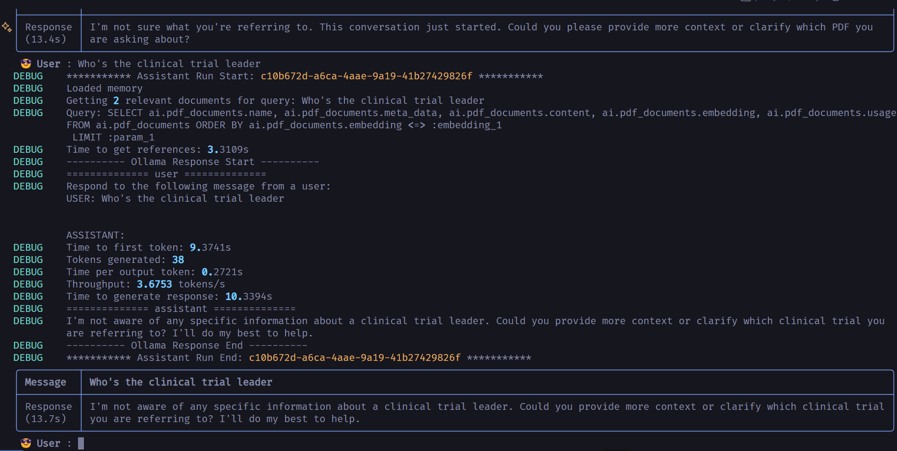

# Testing [Phidata](https://www.phidata.com/)  

Phidata is a Python library for LLM tool calling. This repository contains code I used to test the library's capabilities and to learn how to use it. For example, in the screenshot above, I attempted to give Llama3.1:8b access to two PDFs, albeit unsuccessfully.

## Installation and Usage  
Ensure you have Python and [Poetry](https://python-poetry.org/) installed.  
1. Clone the repository
2. Run `poetry install` to install the dependencies
3. Run `poetry run python -m src` to run the project